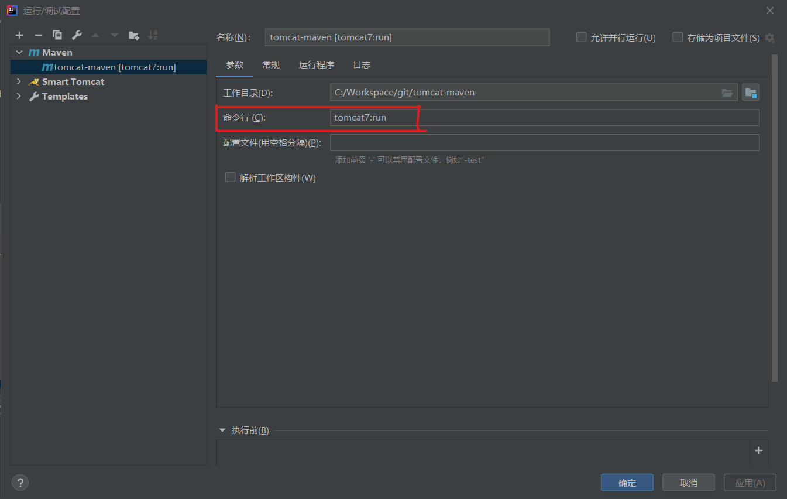
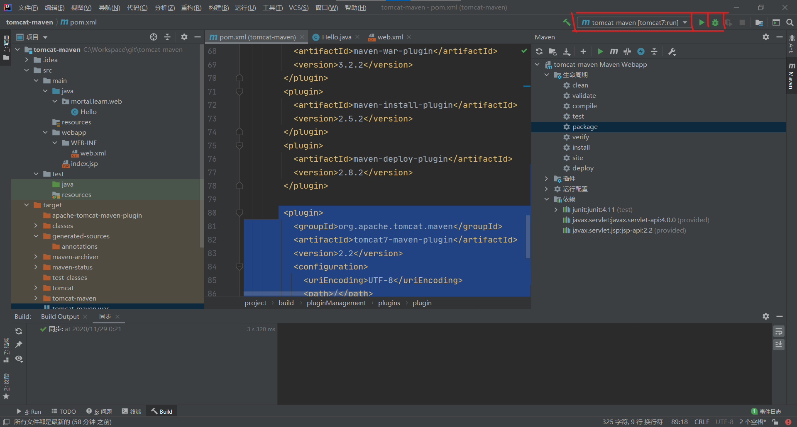
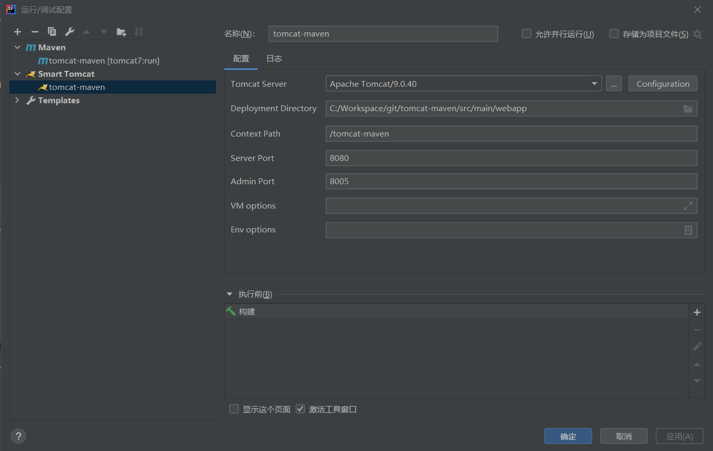
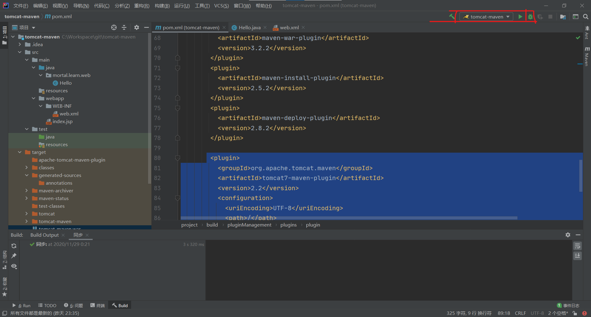

# Servlet

### Idea(社区版)开发
1. maven项目添加servle API依赖
```xml
    <dependency>
      <groupId>javax.servlet</groupId>
      <artifactId>javax.servlet-api</artifactId>
      <version>3.0.1</version>
      <scope>provided</scope>
    </dependency>

    <dependency>
      <groupId>javax.servlet.jsp</groupId>
      <artifactId>jsp-api</artifactId>
      <version>2.2</version>
      <scope>provided</scope>
    </dependency>
```

**注意:** 
- &lt;scope&gt;指定为`provided`，表示**编译时使用**，
- 但不会打包到.war文件中，因为运行期**Web容器**本身已经提供了`Servlet API`相关的`jar`包。

2. 在IDE使用使用tomact，有两种方法
    1. [推荐]使用`maven`内置`tomcat`插件（即不需要安装本地tomcat,可以直接在idea里面运行程序）
        >不想第2个方法，还需要开发人员手动安装tomcat，idea插件。
        >使用这个方法，可以让开发人员直接测试url，而不需要考虑服务器的问题。
        >这样子能让开发人员专注于代码，而不是配置，所以比较好。
        >**不过这个插件可能不太适合tomcat9,我用的是tomcat9。**
        >但是目前他已经可以运行了，所以暂时不考虑其他问题。
        1. 在pom.xml文件添加插件描述：
        ```xml
         <plugin>
          <groupId>org.apache.tomcat.maven</groupId>
          <artifactId>tomcat7-maven-plugin</artifactId>
          <version>2.2</version>
          <configuration>
            <uriEncoding>UTF-8</uriEncoding>
            <path>/</path>
            <port>52500</port>
          </configuration>
        </plugin>
        ```
        2. 配置**maven运行配置**：运行->编辑配置->左上角`+`->maven
        
        3. 通过maven运行配置运行webapp并启动tomcat
        
    2. idea社区版使用`smart tomcat`插件(不推荐),使用本地tomcat。
        1. 安装`smart tomcat`插件然后配置`tomcat`运行环境
        2. 配置**smart tomcat运行配置**
        
        3. 通过smart tomcat运行webapp并启动
        

3. 参考资料
    - [servlet入门，关键看导入servlet-api](https://www.liaoxuefeng.com/wiki/1252599548343744/1304265949708322)
    - [servlet开发，关键看导入tomcat](https://www.liaoxuefeng.com/wiki/1252599548343744/1266264743830016)
    - [idea社区版使用maven运行web项目](https://www.cnblogs.com/yangjiming/p/9207911.html)
    - [maven启动web项目发现异常处理方法](https://blog.csdn.net/u011781521/article/details/53713162)
    - [安装插件smart tomcat](https://zhuanlan.zhihu.com/p/271192032)
    - [添加来时本地tomcat容器的`servlet-api.jar`](https://blog.csdn.net/weixin_41069280/article/details/79777419)


### maven部署Web应用

1. 安装tomact，请参阅tomact，本地安装与配置，认识与了解。
2. 编译程序，请参阅tomact，本地安装与配置，认识与了解。
3. 打包war程序：
    1. 运行Maven命令`mvn clean package`，在`target`目录下得到一个`hello.war`文件，这个文件就是我们**编译打包后的`Web`应用程序**。
4. 运行war程序：
    1. 把`hello.war`复制到`Tomcat`的`webapps`目录下，
    2. 然后切换到`bin`目录，执行`startup.sh`或`startup.bat`启动Tomcat服务器：

### Tomact，本地安装与配置，认识与了解。

#### 配置与启动
1. [下载Tomact 9, 建议core版本](https://tomcat.apache.org/download-90.cgi)
2. 解压缩到特定目录，如：C:\Software\tomact
3. 配置`CATALINA_HOME`环境变量，值为tomcat解压文件所在目录。
4. 启动tomcat
    - windows环境：运行子目录bin下的`startup.bat`文件。
    - linux返回：运行子目录bin下载`startup.sh`文件。
5. 关闭tomcat
    - windows环境：运行子目录bin下的`shutdown.bat`文件。
    - linux返回：运行子目录bin下载`shutdonw.sh`文件。
6. 访问tomact的默认应用程序：`http://localhost:8080/`
7. 解决控制台乱码：
    修改`config/logging.properties`文件中的`java.util.logging.ConsoleHandler.encoding` 的值为`GBK`

#### 配置与编译

由于 Servlet 不是 Java 平台标准版的组成部分，所以您必须**为编译器指定 Servlet 类的路径**。
- 所以编译servlet程序时候，需要指定`servlet-api.jar`的类路径。
- 编译JSP程序时候，需要指定`jsp-api.jar`的类路劲。
- 它们都位于位于`lib`子目录中。

**注意：** 这里的编译指的是`javac`编译，如果使用ide，请看参阅idea开发。
```cmd
>javac -classpath tomcat/lib/servlet-api.jar  -d ./classes src/hello.java
```

#### 配置与部署应用
1. Web应用程序打包成war文件。
2. 将war文件复制到Tomcat的`webapps`目录下
3. URL的第一级目录为**web程序名**，后面才是程序中映射的路径。
    >例如`hello.war`的路径以`http://localhost:8080/hello/`开始。
    >因为一个Web服务器**允许同时运行多个Web App**，
    >而我们的Web App叫`hello`，因此，第一级目录`/hello`表示`Web App`的名字，
    > **后面的`/`** 才是我们在`HelloServlet`中映射的路径。
4. `ROOT.war`：文件名为`ROOT`的应用程序将作为默认应用，启动后直接访问`http://localhost:8080/`。

#### tomcat了解
1. 实际上，类似Tomcat这样的服务器也是Java编写的，
2. 启动`Tomcat`服务器实际上是启动`Java`虚拟机，执行Tomcat的`main()`方法，
3. 然后由`Tomcat`负责加载我们的`.war`文件，并创建一个HelloServlet实例，最后以**多线程的模式**来处理HTTP请求。

手动启动tomcat示例。
```java
public class Main {
    public static void main(String[] args) throws Exception {
        // 启动Tomcat:
        Tomcat tomcat = new Tomcat();
        tomcat.setPort(Integer.getInteger("port", 8080));
        tomcat.getConnector();
        // 创建webapp:
        Context ctx = tomcat.addWebapp("", new File("src/main/webapp").getAbsolutePath());
        WebResourceRoot resources = new StandardRoot(ctx);
        resources.addPreResources(
                new DirResourceSet(resources, "/WEB-INF/classes", new File("target/classes").getAbsolutePath(), "/"));
        ctx.setResources(resources);
        tomcat.start();
        tomcat.getServer().await();
    }
}
```