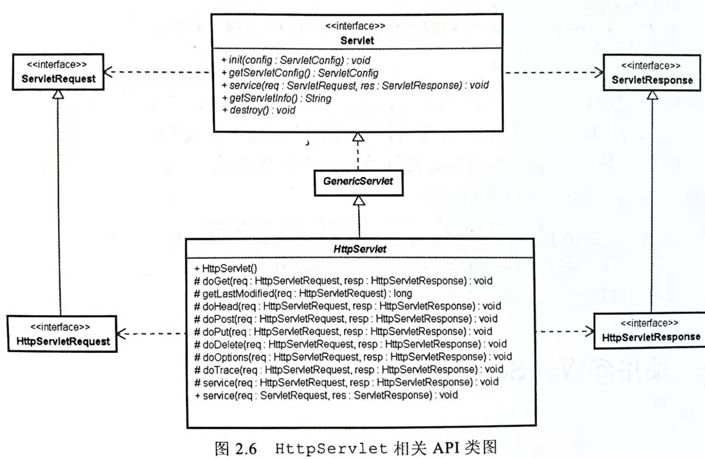
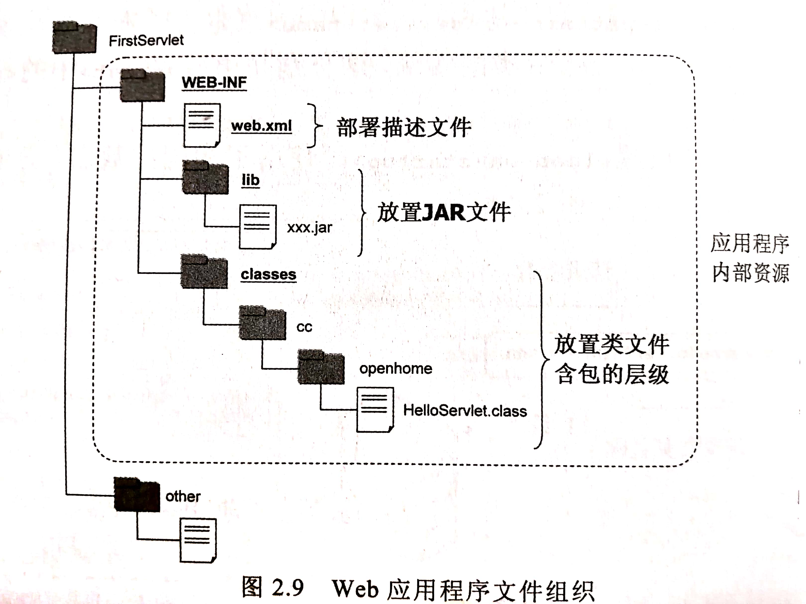

## 基本部署设置

### FirstServlet
```java
package mortal.learn.dev.web.servlet;

import javax.servlet.ServletException;
import javax.servlet.annotation.WebServlet;
import javax.servlet.http.HttpServlet;
import javax.servlet.http.HttpServletRequest;
import javax.servlet.http.HttpServletResponse;
import java.io.IOException;
import java.io.PrintWriter;

@WebServlet("/hello")
public class Hello extends HttpServlet {

    @Override
    protected void doGet(HttpServletRequest request, HttpServletResponse response) throws ServletException, IOException {

        response.setContentType("text/html;charset=UTF-8");

        String name = request.getParameter("name");

        PrintWriter out = response.getWriter();
        out.println("Hello, " + name);

    }
}
```
- `@WebServlet`注解的`name`属性，告知容器该`servlet`处理那些url。
- `HttpServlet`处理http，继承它并实现`doXXX`,doXXX方法处理对应的http请求方法。
- `HttpServletRequest`**对象**封装HTTP请求的相关信息。
    - `getParameter(String name)`通过请求参数名获取参数值
- `HttpServletRespone`**对象**表示浏览器响应
    - `getWriter()`取得代表响应输出的`PrintWriter`对象。
    - `setContentType(String content_type)`设置响应头的`Content-Type`字段的值。
- `ServletException`,`IOException`是doXXX方法的异常规范。

### Servlet的API架构

- `Servlet`接口，定义了Servlet的基本行为
    - `init(ServletConfig config)`: 初始化servlet配置，与生命周期相关的方法。
    - `destory`: 销毁servlet，与生命周期相关的方法。
    - `service(ServletRequest req, ServletResponse res)`: 提供服务时调用service方法。
- `GenericServlet`类实现`Servlet`接口和`ServletConfig`接口
    >将容器调用init方法传入的servletConfig示例封装起来。
    >`service`方法标记为`abstract`
- `HttpServlet`：规范有关HTTP的相关方法

**注意** 
- `GenericServlet`没有规范任何有关HTTP的相关方法，
- 而是由继承它的`HttpServlet`定义。
- 最初定义`Servlet`时，并不限定它只能用于HTTP方法，
- 所以HTTP服务流程是定义在`HttpServlet`的`service`中。

HttpServlet的service中的流程：
1. 当请求到来时，容器会调用`Servlet`的`service()`方法。
2. `HttpServlet`的`service()`就是判断请求方法，然后调用对应的`doXXX`方法
3. 所以需要对请求方法进行处理，就必须**继承`HttpServlet`并实现对应的`doXXX`方法**。
```java
protected void service(HttpServletRequest req,
                      HttpServletResponse resp)
    throws ServletException, IOException{
        String methode = req.getMethod();   //取得请求方法
        if(method.equals(METHOD_GET)){      //HTTP GET
            ...
            doGet(req, resp);
            ...
        }else if(method.equals(METHOD_HEAD)){//HTTP HEAD
            ...
            doHead(req, resp);
            ...
        }else if(method.equals(METHOD_POST)){//HTTP POST
            ...
            doPost(req, resp);
            ...
        }else if(method.equals(METHOD_PUT)){//HTTP PUT
            ...
    }

```

## 使用@WebServlet
- 编写好servlet后，接下来要**告诉web容器**关于Servlet的一些信息。
- 自JavaEE 6.0 之后的Servlet3.0，可以使用标注来告知容器哪些servlet会提供哪些**服务以及额外信息**。
- 只要在Servlet上**设置@WebServlet** 标注，Web容器就会**自动读取其中的信息**。


`@WebServlet`注解的属性
- `name`属性：指定Servlet的名称，默认值为Servlet的完整类名
- `urlPatterns`属性：指定了`Servlet`所处理的**`URL`的模式**。
- `loadOnStartup`属性：
    - 设置大于0的值(默认值为-1)，表示**启动应用程序后就初始化`Servlet`**。
        >应用程序启动时，并没有创建所有Servlet实例。
        >容器会在首次接到请求需要某个Servlet服务时，才将对应的Servlet类实例化，初始化，然后处理请求。
        >这意味着第一次请求该Servlet的浏览器，必须等待Servlet实例化，初始化后，才真正得到请求的处理。
    - 数字代表了`Servlet`的**初始化顺序**。
        >若有多个servlet在设置loadOnStartup使用了相同参数，容器的实现厂商可以自行决定要如何载入哪个servlet.

```java
...                                           
@WebServlet(                                    
        name = "Hello",                         
        urlPatterns = "/hello",                 
        loadOnStartup = 1                       
)                                               
public class Hello extends HttpServlet {        
...                                               
```

### 使用Web.xml
- 使用标注来定义Servlet，是在`Java EE 6`的`Servlet6.0`之后的设定。
- 在旧的Servlet版本中，必须在Web应用程序的 **`WEB-INF`文件夹** 中建立`Web.xml`文件来定义Servlet信息。
- 就算可以使用标注，在必要的时候，仍然能使用web.xml文件来定义Servlet。


`web.xml`文件
- 像这种文件称为部署描述文件(Deployment Descriptor)，简称DD文件。
- `<display-name>`定义Web应用程序的名称。
    >注意：`<display-name>`不是Web应用程序环境根目录
- `<defalut-context-path>`: **从servlet4.0 开始**，可以用`<default-context-path>`来建议默认环境路径。
    >注意：考虑到兼容性，容器实现厂商**可以不理会这个设定**。
- `<welcome-file-lise>`定义的文件清单，是在浏览器请求路径**没有指定特定文件**时，会看看路径中是否由列表中的文件，如果有，就会作为**默认页面响应**。
- **覆盖标注**：
    >web.xml中的设定可用来覆盖Servlet中标注，
    >因此可以使用标注来做默认值，而web.xml作为日后更改设定值之用。
    - `<servlet>`:描述一个Servlet
        - `<servlet-name>`: Servlet的名字，对应标注的`name`属性
        - `<servle-class>`: Servlet的完整类名。
        - `<load-on-startup>`: 对应标注的`loadOnStartu`属性
    - `<servlet-mapping>`：定义Servlet服务的URL，需要先定义`<servlet>`标签。
        - `<servlet-name>`: 通过`<servlet-name>`选择一个在`<servlet>`中定义的Servlet,从而找到对应的servlet类
        - `<ulr-pattern>`: 对应这个Servlet所处理的URL的模式。

**注意**：
- 无论是使用`@WebServlet`标注，还是web.xml设置
- 浏览器请求的**URL都是逻辑上的名称**。
    >例如：请求`/hello`并不一定值Web网站上有个实体文件交hello
    >而会由Web容器**对应至实际**处理请求的程序实体名称或文件。
    >如果愿意，可以用hello.view或hello.jsp之类的名称来伪装资源

```xml
<?xml version="1.0" encoding="UTF-8">
<web-app xmlns:xsi="http://www.w3.org/2001/XMLSchema-instance"
xmlns="http:/xmlns.jcp.org/xml/ns/javaee"
xsi:schemaLocation="http://xmlns.jcp.org/xml/ns/javaee http://xmlns.jcp.org/xml/ns/javaee/web-app_4_0.xsd" version="4.0">

    <displaty-name>FirsetServlet</display-name>
    <default-context-path>环境根目录</default-context-path>
    <weclome-file-list>
        <weclome-file>index1.html</weclome-file>
        <weclome-file>index2.html</weclome-file>
        <weclome-file>index3.html</weclome-file>
    <weclome-file-list>

    <!--web.xml中的设定可用来覆盖Servlet中标注-->
    <servlet>
        <servlet-name>Hello</servlet-name>
        <servlet-class>mortal.learn.dev.web.servlet.learn01codingandconfig.Hellomortal.learn.dev.web.servlet.learn01codingandconfig.Hello</servlet-class>
        <load-on-startup>1</load-on-startup>
    </servlet>
    <servlet-mapping>
        <servlet-name>Hello</servlet-name>
        <url-pattern>/helloUser</usr-patten>
    </servlet-mapping>

</web-app>
```

### 文件组织与部署
- IDE为了管理项目资源，会有其项目专属的文件组织
- 但那并不是真正上传至Web容器之后该有的架构
- Web容器要求应用程序如下部署。



- `WEB-INF`: 
    - **名称和位置固定**，且一定位于应用程序**根目录下**。
    - 其内部的文件和文件夹，**对外界封闭**。
        >即浏览器无法通过HTTP的任何方式请求WEB-INF中文件或文件夹
    - 若有需要，必须通过`Servlet/JSP`的**请求转发**(Forward)。
        >不想让浏览器直接存取的资源，可以放置在这个文件夹。
- `web.xml`: Web应用程序的**部署描述文件**，一定要放在**WEB-INF**文件夹中。
- `lib`：用于放置**JAR文件**，一定要放在**WEB-INF**文件夹中。
- `classes`:放置经过编译后的.class文件，一定要放在**WEB-INF**文件夹中。编译后的类文件必须有**与包名称相符**的文件夹结构。

**注释**
- 如果使用tomcat作为web容器，可以将图示的整个FirstServlet文件夹复制到tomcat文件夹下的webapps文件夹。
- 实际上，在部署Web应用程序时，会将应用程序封装为一个WAR（Web Archive)文件。`jar -cvf ../FirstServlet.war *`
- WAR文件采用**ZIP压缩**格式封装。
- Web容器若发现WAR文件，就会将其解压缩，并载入Web应用程序。

## 进阶部署设置。

### URL模式设置
一个请求URL实际上是由3个部分组成的。
- `requestURL = contextPath + servletPath + pathInfo`。
- `HttpServletRequest`的`getRequestURI()`获取请求URL。

#### 环境路径
>环境路径是容器 **挑选哪个Web应用程序的依据** 。（一个容器上可能部署多个Web应用程序）
- `HttpServletRequest`的`getContextPath()`获取环境路径。
- 如果应用程序环境路径与Web网站环境**根路径**相同，则应用程序**环境路径为空字符串**。如果不是，则应用程序环境路径**以`/`开头，不包括`/`结尾**。

#### URL模式与servletPath
>一旦决定是哪个Web应用程序来处理请求，接下来就会进行Servlet对应
>**Servlet必须设置URL模式**，可以设置的格式如下：
- **路径映射(Path mapping)**: 以`/`开头，以`/*`结尾的URL模式
    >例如：`/guest/*`，若为`/guest/text.view`、`/guest/home.view`等以`/guest/`开头，都会交给该Servlet处理。
- **扩展映射(extension mapping)**: 以`*.`开头的URL模式，
    >例如：`*.view`，则以.view结尾的请求都会交给该Servlet处理。
- **环境根目录映射**：空字符串 **""** 是个特殊的URL模式，对应至环境根目录，也就是 **`/`请求** 。
    >例如：若环境根目录为app，则`http://host:port/app/`请求。路径信息是`/`，而Servlet路径与环境路径**都是空字符串**。
- **预设Servlet模式**：仅包好`/`的URL模式，当找不到适合的URL模式对应时，就会使用预设Servlet。
- **完全匹配(Exac match)**: 以`/`开头的，不符合以上设置的其他字符串，都要做路径的严格对应。
    >完全匹配的URL，必须以`/`开始。

**URL模式冲突解决**：
如果URL模式设置比对的规则在某些URL请求上有所重叠，对比规则是**从最严格的URL模式开始服务**。
>例如：模式`/admin/login.do`,`/admin/*`,`*.do`
>如果请求/admin/login.do则由/admin/login.do来处理
>如果请求/admin/setup.do则由/admin/*来处理。

**servlePath**
- servletPath值Servlet路径，不包括路径信息与请求参数。
- servletPath直接对应值URL模式信息。
- `HttpServletRequest`的`getServletPath()`可获得servletPath。
- Servlet路径基本以`/`开头。
- 在`/*`与`""`URL模式下，getServletPath取得的Servlet路径是**空字符串**。
    >例如：`/hello.do`->`/hello.do`，
    >`/servlet/*`->`/servlet`。
    >`""`->`""`

#### 路径信息
- pathInfo是指路径信息。
- 路径信息不包括请求参数，指的是不包括环境路径与Servlet路径部分的额外路径信息。
- `HttpServletRequest`的`getPathInfo()`获取路径信息。
- 如果没有额外路径信息，返回值为`null。
    >扩展映射，预设Servlet完全匹配的情况下，返回null
- 如果由额外路径信息，则是一个以`/`开头的字符串。

### HttpServletMapping
- 在Servlet4.0 `HttpServletRequest`新增了`getHttpServletMapping()`方法，可以取得`javax.servlet.http.HttpServletMapping`操作对象。
- 通过该对象能在执行时期，侦测执行中的Servlet是通过**哪个URL**对应而来，以及**被对比到的值**为何等信息。

- `HttpServletMapping`对象的`getMappingMatch()`会传回`javax.servlet.http.MappingMatch`枚举值。成员有：
    - `CONTEXT_ROOT`：环境根目录。
    - `DEFAULT`: 预设servlet。
    - `EXACT`: 完全匹配。
    - `EXTENSION`: 扩展映射。
    - `PATH`: 路径映射。
- `HttpServletMapping`对象的`getMatchValue()`返回实际符合的比对值。
- `HttpServletMapping`对象的`getPattern()`返回对比时的URL模式。

### Web文件夹结构

文件结构：
- 一个Web应用程序基本由以下项目组成：
    - 静态资源（HTML，图片，声音，影片）
    - Servlet
    - JSP
    - 自定义类
    - 工具类
    - 部署描述文件(web.xml)，设置信息（Annotation)。
- 基本上根目录中的资源可以**直接下载**。
- `/WEB-INF`文件夹下资源 **无法直接下载** 。WEB-INF中的资源项目有一定的名称与结构
- `/WEB-INF/web.xml` 是部署描述文件
- `/WEB-INF/classes` 用来放置应用程序用到的**自定义类**(.class)，必须包括包结构。
- `WEB-INF/lib`放置应用程序用到的JAR文件。
    >JAR文件中可以放置Servle、JSP、自定义类、工具类、部署描述文件等。
    >应用程序的类类载入器可以从JAR中载入对应的资源。
- JAR文件中`/META-INF/resources`可以放置静态资源或JSP。

#### 资源请求规则：
- 若请求静态资源，
    >若请求`/openhome/index.xml`，实际上`/openhome`根目录下不存在index.xml，**则会使用JAR中的`/META-INF/resources/index.xml`**
- 若要用到某个类，
    >1. 先在`/WEB-INF/classes`中试着载入，
    >2. 若无，则试着从`/WEB-INF/lib`的JAR文件中搜索类文件
    >3. 若无，则会到容器本身存放类或JAR文件中搜索，位置视厂商而有所不同。
- 通过程序控制取得`WEB-INF`的资源
    >浏览器不可以直接请求/WEB-INF中的资源，但可以通过程序控制取得WEB-INF中的资源。
    >例如：`ServletContext`的`getResource()`与`getResourceAsStream()`，或者通过`RequestDispatcher`请求调派。
- 请求URL以`/`结尾。
    1. 若确实存在该文件夹，则Web容器返回该文件夹下的**欢迎页面**，
        >可以在部署描述文件web.xml中包括`<welcome-file-list>`、`<welcom-file>`定义，指出欢迎页面为何文件。
        >若是同一个文件夹下有多个在`<welcome-file-list>`被指定为欢迎页面，则会返回第1个搜索到的文件。
    2. 如果找不到欢迎用的文件，则会尝试值JAR的`/META-INF/resources`寻找已放置的资源页面。
    3. 如果不存在该文件夹，会使用默认Servlet。（如果有定义）
- 整个Web应用程序可以封装为WAR文件。

#### 使用web-fragment.xml
- `Servlet3.0`以后，可以使用标注来设置Servlet的相关信息。
- 实际上，Web容器也可以读取**JAR文件中**有使用标注的Servlet，载入类并注册为Servlet进行服务。
- `Servlet3.0`以后，JAR文件可用来作为Web应用程序的**部分模块**。视需要，弹性抽换Web应用程序的功能组件。

`web-fragment.xml`
1. `web-fragment.xml`是每个JAR文件可定义的部署描述文件，**必须放置在`META-INF`**文件夹中。
2. `web.xml`可定义的元素，`web-fragment.xml`都可定义。
3. `web-fragment.xml`的根标签是`<web-fragment>`而不是`<web-app>`。
```xml
<?xml version="1.0" encoding="UTF-8"?>
<web-fragment id="WebFragment_ID" version="4.0"
xmlns:xsi="http://www.w3.org/2001/XMLSchema-instance"
xmlns="http:/xmlns.jcp.org/xml/ns/javaee"
xsi:schemaLocation="http://xmlns.jcp.org/xml/ns/javaee http://xmlns.jcp.org/xml/ns/javaee/web-app_4_0.xsd" version="4.0">

    <displaty-name> WebFragment1 </display-name>
    <name>WebFragment1</name>

    <servlet>
        <servlet-name>Hello</servlet-name>
        <servlet-class>mortal.learn.dev.web.servlet.learn01codingandconfig.Hellomortal.learn.dev.web.servlet.learn01codingandconfig.Hello</servlet-class>
        <load-on-startup>1</load-on-startup>
    </servlet>
    <servlet-mapping>
        <servlet-name>Hello</servlet-name>
        <url-pattern>/helloUser</usr-patten>
    </servlet-mapping>
    
</web-fragment>

```

`web.xml`与`web-fragment.xml`
- `web.xml`与标注的配置顺序在规范中没有定义
- `web-fragment.xml`及标注的配置顺序也没有定义
- 但可以决定`web.xml`与`web-fragment`的配置顺序。

在`web.xml`中使用`<absolute-ordering>`定义绝对顺序。
1. 各个JAR文件中`web.fragment.xml`定义的名称不得重复。
2. 若有重复，会忽略重复的名称。
```xml
<web-app ..>
    <absolute-ordering>
        <name>WebFragment1</name>
        <name>WebFragment2</name>
    </absolute-ordering>
</web-app>
```

在`web-fragment.xml`中使用`<ordering>`,在其中使用`<before>`,`<after>`定义顺序
1. 若有3个web-fragment.xml文件如下定义
2. 而web.xml没有额外定义顺序信息。
3. 则载入定义顺序是: web.xml <name>名称为WebFragment3, WebFragment2,WebFragment1的web-fragment.xml中的定义。 
```xml

<web-fragment ...>
    <name>WebFragment1</name>
    <ordering>
        <after><name>WebFragment2</name></after>
    <ordering>
</web-fragment>

<web-fragment ...>
    <name>WebFragmen2</name>
</web-fragment>


<web-fragment ...>
    <name>WebFragment3</name>
    <ordering>
        <before><other/></before>
    <ordering>
</web-fragment>

<web-app ..>
...
</web-app>
```

`metadata-complete`属性
- 如果`web.xml`中的`<web-app>`的`metadata-complete`属性设置为`true`(默认为`false`)。
    >则表示web.xml已完成Web应用程序的定义。
    >部署时就**不会扫描`web-fragment.xml`**。
    >如果有`<absolute-ordering>`与`<ordering>`也会被忽略。
- 如果`web-fragment.xml`中的`<web-fragment>`的`metadata-complete`属性设置为`true`(默认为`false`)，**就只会处理自己JAR文件中的标注信息**。
    >如果`web-fragment.xml`中指定的类可在web应用程序的`/WEB-INF/classes`中找到，就会使用该类
    >要注意的是，如果该类本身有标注，而web-fragment.xml又定义该类为Servlet
    >此时将会有两个Servlet实例。
    >如果`web-fragment.xml`中的`<web-fragment>`的`metadata-complete`属性设置为`true`(默认为`false`)，**就只会处理自己JAR文件中的标注信息**。