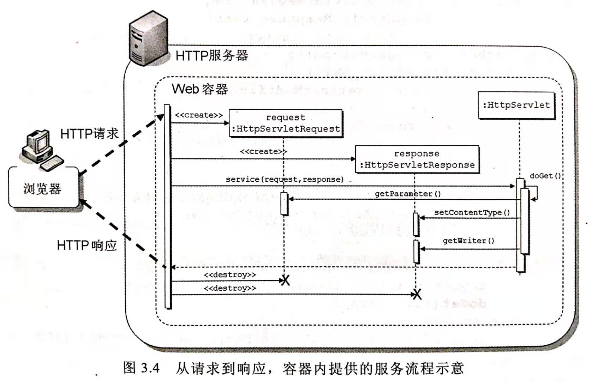
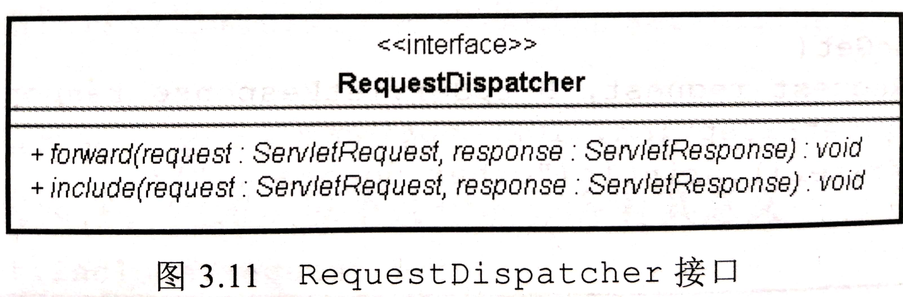
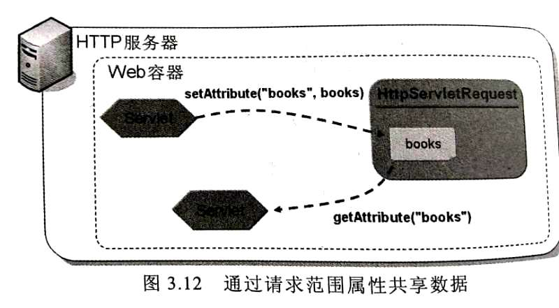

**时刻记住**：Web容器时Servlet/JSP唯一认识的HTTP服务器！

## 从容器到HttpServlet

### Web容器服务处理流程

1. **转交请求**：HTTP服务器转交请求给容器
2. **创建对象**：
    1.  **请求对象**：容器创建`HttpServletRequest`对象，将请求相关信息设置给该对象
    2. **响应对象**：容器创建一个`HttpServletResponse`对象，表示稍后对浏览器的响应。
3. **调用服务**：
    1.  **选择`Servlet`**：容器根据`@WebServlet`或`web.xml`的设置，找出处理该请求的`Servlet`对象。
    2. **调用服务接口**：容器调用`Servlet`对象的`service()`方法，将创建的`HttpServletRequest`和`HttpServletResponse`对象传入作为参数。
    3.  **处理请求**：`service()`方法根据HTTP请求方法调用`doXXX()`处理请求。
4.  **发送响应**：
    1. 容器将`HttpServletRespone`对象中的响应内容转化为HTTP响应。
    2. 由HTTP服务器将HTTP响应传回浏览器。
5. **销毁对象**：
    1. 销毁`HttpServletRequset`对象。
    2. 销毁`HttpServletReponse`对象。

#### Web容器解说
- **符合HTTP基于请求/响应，无状态的模型**。
    >每次请求/响应对象在服务结束时都会销毁。
    >也就是说每次请求/响应对象彼此无关，符合了HTTP基于请求/响应，无状态的模型。
- **Web容器管理了多种对象的生命周期**。
    >请求/响应对象的创建和销毁也是Web容器提供的功能。
    >其实，不只是请求/响应对象，Web容器管理了多种对象的生命周期

### doXXX()方法
1. `HttpServlet`的`service()`方法通过调用`doXXX()`方法来处理`XXX`请求。
2. 所以需要继承`HttpServlet`并实现`doXXX()`方法才能处理`XXX`请求。
    >如果浏览器发出了没有实现的请求，就会收到错误信息。
    >HttpServlet对应的处理请求方法如下：
    - `doGet()`:        处理GET请求。
    - `doPost()`:       处理POST请求。
    - `doPut()`:        处理PUT请求。
    - `doDelete()`:     处理DELETE请求。
    - `doHead()`:       处理HEAD请求。
    - `doOptions()`:    处理OPTIONS请求。
    - `doTrace()`:  处理TRACE请求。
3. 注意容器调用的方法
    - 容器是调用`Servlet`的`service()`来提供服务，然而这个`service()`方法的签名是`ServletRequest`，`ServletRepsponse`。
    - 所以，容器并不是调用`HttpServlet`中实现HTTP服务的`service()`。
    - 而是调用`HttpServlet`中继承于`Servlet`的`sevice()`。
    - 所以容器调用服务的关键是在`Servlet.service()`方法中调用`HttpServlet。service()`，并是实现对应的`doXXX()`方法。

#### 两个`service()`的实现
- `getLastModified`：返回自1970年1月1日凌晨至资源最后一次更新所经过的毫秒数。
    >默认返回-1，也就是默认不支持`if-modified-since`标头。
- 返回时间晚于浏览器发出的`if-modified-since`标头，才会调用`doGet()·方法。
```java
public void service(ServletRequest req, ServleResponse res)
throws ServletException, IOEXception{
    HttpServletRequest request;
    HttpServletResponse response;

    try{
        request = (HttpServletRequest) req;
        response = (HttpServletResponse) res;
    }catch(ClassCastException e){
        throw new ServletException("non-HTTP request or response");
    }

    service(reqeust, response);//调用下面的service()
}

protected void service(HttpServletRequest req, HttpServletResponse resp)
throws ServletException, IOException{
    String method = req.getMethod();
    if(method.equals(METHOD_GET)){
        long lastModified = getLastModified(req);
        if(lastModified == -1){
            doGet(req, resp);       //处理GET请求
        }else{
            long ifModifiedSince;
            try{
                ifModifiedSince = req.getDateHeader(HEADER_IFMODSINCE);
            }catch(IllegalArgumentException iae){
                ifModifiedSince = -1;
            }
            if(ifModifiedSince < (lastModified/1000*1000)){
                maybeSetLastModified(resp, lastModified);
                doGet(req, resp);   //处理GET请求
            }else{
                resp.setStatus(HttpServletResponse.SC_NOT_MODIFIED);
            }
        }
    }else if(method.equals(METHOD_HEAD)){
        long lastModified = getLastModified(req);
        doHead(req, resp);
    }else if(method.equals(METHOD_POST)){
        doPost(req, resp);
    }else if(method.equals(METHOD_PUT)){
        略....
}
```

#### `HttpServlet`中的`doGet()`
>如下所示，如果浏览器发出了没有实现的请求，就会收到错误信息。
```java
protected void doGet(HttpServletRequest req, HttpServletResponse resp)
throws ServletException, IOException{
    Strig protocol = req.getProtocol();
    String msg = lStrings.getString("http.method_get_not_supporte");
    if(protocol.endsWith("1.1")){
        resp.sendError(HttpServletResponse.SC_METHOD_NOT_ALLOWED, msg);
    }else{
        resp.sendError(HttpServletResponse.SC_BAD_Request, msg);
    }
}
```

## HttpServletRequest

### 处理请求参数

使用`HttpServletRequest`的如下方法处理请求参数。

- `String getParameter(String name)`: 指定请求参数名称取得对应值，没有指定请求参数返回 **`null`** 。
    >要注意null安全，可以选择使用`Optional`来处理。例如：
    >`String name = Optional.ofNullable(request.getParameter("name")).orElse("Guest");`
- `String[] getParameterValues(String name)`: 返回指定请求参数名的所有值。
    >如果窗体上有可复选的元件，如复选框(Checkbox)、列表，同一请求参数名称会有多个值
    >HTTP查询字符串实际上形如`param=10&param=20&param-30`。
- `Enumeration<String> getParameterNames()`: 获取全部请求参数名。
- `Map<String, String[]> getParameterMap()`: 获取全部请求参数以及它们的所有值。key时请求参数名，value是请求参数值。

### 处理请求标头
使用`HttpServletRequest`的如下方法处理请求标头。

- `String getHeader(String name)`: 指定标头名称返回字符串值。
- `Enumeration<String> getHeaders(String name)`: 指定标头名称返回所有值。
- `Enumeration<String> getHeaderNames()`: 取得所有标头名称。

### 处理`Enumeration`

- `Enumeration`是JDK1.0的接口，功能与`Iterator`重叠。
- 建议使用`Collection.list()`将`Enumeration`转化为`ArrayList`.
- 以便使用增强的for语法，甚至Java SE 8 的Lambda、 Stream API等结合使用。

### 请求参数编码处理
使用`HttpServletRequest`的如下方法处理设置请求。

- `HttpServletRequest`的`getCharacterEncoding()`返回`Conten-Type`标头设置的 **字符编码信息** 。若浏览器没有设置这个标头，该方法 **返回`null`** 。
- **URI编码**由HTTP服务器处理。
- **请求体编码**由容器处理。

**编码问题的产生:** 
>假设浏览器使用UTF-8发送请求。
>GET请求一般将参数放在`URL`的查询字符串。
>POST请求一般将参数放在请求体。
>所以会出现以下问题。
- 当浏览器的编码与HTTP服务的编码不同时，处理 **`GET`方法** 时，`HttpServletRequest`的`getParameter()`获得参数值将是 **不正确的** 。
- 当浏览器的编码与HTTP服务的编码不同时，处理 **`POST`方法** 时，`HttpServletRequest`的`getParameter()` 获得参数值将是 **不正确的** 。

**解决编码问题:** 

**`POST`请求参数编码处理:**
- 假设容器默认使用`ISO-8859-1`编码。
- 假设浏览器使用`UTF-8`编码
```java
//浏览器相当于做了这个动作。
String text = java.net.URLEncoder.encode("林", "ISO-8859-1");
//在Servlet中取得请求参数时，容器相当于做了这个动作。
String text = java.URLDecoder.decode("%E5%9E%97", "ISO-8859-1");
```
1. 解决方法一：在获得任何请求值**之前**，执行语句：`request.setCharacterEncoding("UTF-8");`

web.xml
2. 从Servlet4.0开始，可以在`web.xml`加入标签`<request-character-encoding>`处理**整个应用程序**的请求。
```xml
<request-character-encoding>UTF-8</request-character-encoding>
```

**`GET`请求参数编码处理:**
- `setCharaterEncoding()`方法对于请求本体中字符编码才有作用
- 故只能通过对参数值**转换编码**的方式来处理。
```java
String name = request.getParameter("name");
name = new String(name.getBytes("ISO-8859-1"), "UTF-8");
```

**注释**：建议在过滤器中处理编码问题。让Servlet专注于业务逻辑。

### 读取内容`getReader(),getInputStream()`
- `getReader()`方法获取`BufferReader`对象，通过该对象可以处理**请求的Body数据**。
- `getInputStream()`获取`ServletInputStream`对象，代表请求Body的串流对象。
    >可以用来处理上传的**文件区段**，当时很麻烦，建议使用`getPart()`或`getParts()`方法。
- 同意请求期间。上述两个方法只能**择一调用**，否则抛出`IllegalStateException`异常。

### 取得上传文件`getPart()`、`getParts()`。

- `Servlet3.0`中，新增 **`Part`接口** 。可以方便进行文件处理。
- `HttpServletRequest`的`getPart(String name)`方法取得`Part`对象。**要指定名称取得对应的`part`对象**。
    >名称是`form`表单的`action`属性的值。
- `HttpServletReques`的`getParts()`返回`Collection<Part>`。
    >如果有多个文件上传，就用这个方法，其中有每个上传文件的part对象。1
- `@MultipartConfig`：需为`Servlet`添加该标注，才能使用`getPart()`相关的API。**否则返回null**。
    - **属性`fileSizeTreshold`**: 整数值设置，若上传文件大小 超过设置门槛，会先写入缓存文件，默认值为0.
    - **属性`location`** ： 字符串设置，设置写入文件时的目录，默认为空字符串。
        >如果设置这个属性，则缓存文件就是写到指定的目录。
        >也可搭配`Part`的`write()`方法使用。
    - **属性`maxFileSize`**: 限制上传文件大小，默认值为-1L，表示不限制大小。
    - **属性`maxRequestSize`**: 限制`multipart/form-data`请求格数，默认值为-1L，表示不限制个数。
```java
@MultipartCofig使用示例，待写。


```
**`Part`对象处理文件:**

`multipart/form-data`发送的每个内容区段，都会有以下标头信息
```http
Content-Disposition: form-data; name="filename"; filename="caterpillar.jpg"
Content-Type: image/jpeg
```

- `Part`对象的`String getHeader(String name)`方法，指定标头名称来取得对应的值。
    >所以想取得上传文件名称，就是取得`Content-Dieposition`标头的值，
    >然后取得`filename`属性的值。
    >最后再利用JavaI/O API写入文件。
- `Part`对象的`getName()`方法获得名称。
- `Servlet 3.1`中，`Part`新增`getSubmittedFileName()`，可以取得上传文件名。
    >各浏览器发送的文件名会有差异，有的只有文件名，有的可能包括路径。
    >`getSubmittedFileName()`API 没有规定如何处理这个差异。
    >就`Tomcat9`，遇到`\`的话，会过滤掉，会造成无法判断真正的文件名。
    >**就安全考虑，不建议将浏览器发送的文件名直接作为存盘是的文件**。
- `Part`的`write(String fileName)`方法，可以直接将上传文件指定文件名写入磁盘。
    >写入路径时相对于`@MultipartConfig`的`location`设置的路径。
- `Part`的`getInputStream()`获得代表body的串流对象。

**web.xml设置`@MultipartConfig`对应的信息:**

```xml
<servlet>
    <servlet-name>UploadServlet</servlet-name>
    <servlet-class>org.example.UploadServlet</servlet-class>
    <multipart-config>
        <location>C:/Workspace</location>
    </multipart-config>
</servlet>
```

### 使用`RequestDispatcher`调派请求
>在Web应用程序中，经常需要多个`Servlet`来完成请求。例如，
>将另一个Servlet的处理流程 **包含(`Include`)** 进来，
>或将请求 **转发(`Forward`)** 给别的Servlet处理。



- `HttpServletRequest`的`getRequestDispatchar(String url)`方法取得`RequestDispatcher`接口的实现对象实例。
- 调用时指定转发或包含的 **相对URL网址** 。
- 还有两个方式可以获得`RequestDispatcher`对象。
    - `ServletContext`的`getRequestDispatcher()`
    - `ServletContext`的`getNamedDispatcher()`。

>请求的`include()`或`forward()`是属于容器内部流程的调派，
>而不是在响应中要求浏览器重新请求某些URL。
>因此浏览器不会直到实际的流程调派。
>也就是说，浏览器地址栏上不会有任何变化。

#### 使用`RequestDispatcher`的`include()`方法

- `dispatche`会根据URL模式取得对应的Servlet。
- 调用`include()`必须时实现`ServletRequest`，`ServletResponse`接口的对象。
    - 可以是`service()`方法传入的对象。
    - **或者是自定义对象或封装器**。
- 传入的URL可以包含 **查询字符串** 。如下所示，那么在被包含或被转发的`Servlet`中就可以使用`getParameter("data")`取得参数值。
```java
RequestDispatcher dispatcher = request.getRequestDispatcher("other。vew?data=12345");
dispatcher.include(request, response);
```

**使用include的注意事项：**
- 使用`include()`时，被包含的Servlet中任何对请求标头的设置**都会被忽略**。
- 被包含的`Servlet`可以使用`getSession`对象。（这是唯一的例外）
    >因为HttpSession底层默认使用Cookie，所以响应会加上Cookie请求标头。


#### 用`RequestDispatcher`的`froward()`方法

- `RequestDispatcher`的`forward()`方法，表示请求处理转发给别的Servlet.
- 对浏览器的响应同时也转发给另一个Servlet。
    >这便是与`include()`的不同，
    >`include()`只是包含另一个servlet的处理流程。
    >最后对浏览器的响应是由自己发送的。

**使用`forward()`注意事项：**

- 若要调用`forward()`方法，目前的Servlet**不能有任何响应确认(Commit)**。
- 如果在目前的Servlet通过响应对象**设置了一些响应但未被确认**，则所有响应设置**会被忽略**。
- 如果已经有响应确认且调用了`forward()`方法，则会抛出`IllegalStateException`异常
>既然是转发给别人处理，那么自己就不应该处理响应对象。

#### 请求范围属性
- 在`include()`或`forward()`时包括请求参数得做法，仅适用于**传递字符串**。
- 若要共享对象，则使用`HttpServletRequest`的`setAttribute(String name, Object obj)`可以设置给请求对象成为属性，称为**请求范围属性**。
    >请求对象仅在此次请求周期内有效，在请求/响应之手，请求对象会被销毁回收。
    >设置在请求对象的属性自然也就消失了，所以才称为请求范围对象。



- `HttpServletRequest`对象的请求范围属性的几个方法如下：
    - `setAttribute(String name, Object obj)`: 指定名称与对象设置属性。
    - `Object getAttribute(String name)` 指定名称取得苏醒。
    - `getAttributeNames()`: 取得所有属性名称。
    - `removeAttribute(String name)`: 根据名称移除属性。

**`include()`可用的保留的属性名，特殊意义的属性：**

- `javax.servlet.include.request_uri`
- `javax.servlet.include.context_path`
- `javax.servlet.include.servlet-path`
- `javax.servlet.include.query_string`
- `javax.servlet.include.mapping`(Serlvet4.0新增)
>1. request,response对象来自最前端的servlet.
>2. 在后续的servlet中使用request对象的getRequestURI()等方法，与第一个Servlet中的得到的信息时相同。
>3. 有时候需要得到`include()`时传入的路径信息，就需要通过这些属性名称来获取。
>4. 如果被包含的Servlet中还包括其他servlet，这些属性名称的对应值也会被替换。

`RequestDispatcher`定义了常数来获取这些属性名称，我们不需要记忆它们。
- `RequestDispatcher.INCLUDE_REQUEST_URI`
- `RequestDispatcher.INCLUDE_CONTEXT_PATH`
- `RequestDispatcher.INCLUDE_SERVLET_PATH`
- `RequestDispatcher.INCLUDE_PATH_INFO`
- `RequestDispatcher.INCLUDE_QUERY_STRING`
- `RequestDispatcher.INCLUDE_MAPPING`(Serlvet4.0新增)


**`forward()`可用的保留的属性名，特殊意义的属性：**

- `javax.servlet.forward.request_uri`
- `javax.servlet.forward.context_path`
- `javax.servlet.forward.servlet-path`
- `javax.servlet.forward.query_string`
- `javax.servlet.forward.mapping`(Serlvet4.0新增)
>1. request,response对象来自最前端的servlet.
>2. 在后续的servlet中使用request对象的getRequestURI()等方法，与第一个Servlet中的得到的信息时相同。
>3. 有时候需要得到`include()`时传入的路径信息，就需要通过这些属性名称来获取。
>4. 如果被包含的Servlet中还包括其他servlet，这些属性名称的对应值也会被替换。

`RequestDispatcher`定义了常数来获取这些属性名称，我们不需要记忆它们。
- `RequestDispatcher.FORWARD_REQUEST_URI`
- `RequestDispatcher.FORWARD_CONTEXT_PATH`
- `RequestDispatcher.FORWARD_SERVLET_PATH`
- `RequestDispatcher.FORWARD_PATH_INFO`
- `RequestDispatcher.FORWARD_QUERY_STRING`
- `RequestDispatcher.FORWARD_MAPPING`(Serlvet4.0新增)

## HttpServletResponse

### 设置响应标头，缓冲区
- `HttpServletResponse`对象的`setHeader(String name, String value)`：设置**响应标头名称与值**。
- `HttpServletResponse`对象的`addHeader(String name, String value)`可以在同一个标头名称上**附加值**。
- 标头值是**整数**：可以使用`HttpServletResponse`对象的
    - `setIntHeader(String name, int value)`和
    - `addIntHeader(String name, int value)`
- 标头值是**日期**：可以使用`HttpServletResponse`对象的
    - `setDateHeader(String name, int value)`和
    - `setDateHeader(String naem, int value)`。

**有些标头必须搭配HTTP状态码：**
- `HttpServletResponse`对象的`setStatus(int status)`设定状态代码
    - `200 OK`: 传入`HttpServletResponse.SC_OK`来设定
    - `301 Moved Permanently`: 传入`HttpServletResponse.SC_MOVED_PERMANENTLY`来设定
    - `302 Found`: 传入`HttpServletResponse.SC_SC_FOUND`或者`HttpServletResponse.SC_MOVED_TEMPORARILY`

**例如：**
```java
//若某个资源也许永久性移动到另一个网址，当浏览器请求原有网址是，
//必须要求浏览器重新定向至新网址，并要求未来链接时也应使用新网址
//(像告诉搜索引擎网站搬家了，有利于搜索引擎优化)
response.setStatus(HttpServletResponse.SC_PERMANENTLY);
response.addHeader("Location", "new_url");

//如果资源只是暂时性搬移，或者时将来可能改变，
//任希望客户端依旧使用现有网址来存取资源，
//不要快取资源之类的，可以使用暂时重定向。
response.setStatus(HttpServletResponse.SC_FOUND);
response.addHeader("Location", "new_url");
```

**标头设置注意：**
- 所有标头设置必须在**响应确认之前**。
- 在响应确认之后设置的标头，**会被容器忽略**。

**对响应进行缓冲：**
- 容器可以(非必要)对响应进行缓冲。
- 通常容器默认都会对响应进行缓冲。
- 可以操作`HttpServletResponse`以下关于缓冲的几个方法
    - `getBufferSize()`
    - `setBufferSize(int size)`
    - `isCommitted()`：查看响应是否已确认。
        >在缓冲取未满之前，设置的响应内容不会真正传旨浏览器
        >可以用该方法确认响应是否已确认。
    - `reset()`：重置所有响应信息，连同响应标头一并清除
    - `resetBuffer()`：重置响应内容，不会清除标头内容。
    - `flushBuffer()`：清除所有缓冲区中已设置的响应信息至浏览器。


**注意：**
- `setBuffersize(int size)`必须在调用`HttpservletResponse`的`getWriter()`或`getOutputStream()`方法**之前调用**，
    >取得的`writer()`或`ServletOutputStream`才会套用这个设置。
    >若是相反次序，则抛出`IllegalStateException`异常。
- `reset()`和`resetBuffer()`必须在响应确认之前调用，否则抛出`IllegalStateException`。

### 响应对象关闭的时机
- `Servlet`的`service()`方法结束
- 响应内容长度超过`HttpServlectResponse`的`setContentLength()`所设置的长度。
- 调用了`sendRedirect()`方法。
- 调用了`sendError()`方法。
- 调用了`AsyncContext`的`complete()`方法。(第5章)

### 使用`getWriter()`输出字符
- `HttpServletResponse`的`getWriter()`方法取得`PrintWriter`对象。可以用来输出响应体的字符串内容。
- **注意输出编码:**
    - 在没有设置任何**内容类型和编码**之前，`HttpServletResponse`使用字符默认是`ISO-8859-1`.
    - 也就是说，如果直接输出中文，在浏览器上就会看到乱码。
- 有几种方式可以影响`HttpServletResponse`输出的编码处理。

1. 设置Locale:
    - `HttpServletRequest`对象的`getLocale()`方法取得一个`Locale`对象，表示请求标头`Accept-Language`的值。
    - `HttpServletResponse`对象的的`setLocale(Locale locale)`方法来设置地区信息。
        - 地区信息包括**语系和编码**信息。
        - 语系信息通常通过响应标头`Content-Language`来设置。
        - `setLocale(locale)`也会设置HTTP响应的`Content-Language`标头
    - 在`web.xml`中设置**默认**的区域与编码对应:
        ```xml
        <locale-encoding-mapping-list>
            <locale-encoding-mapping>
            <locale>zh_TW</locale>
                <encoding>UTF-8</encoding>
            </locale-encoding-mapping>
        </locale-encoding-mapping-list>
        ```
    - 设置好上述信息后，
        >- 若使用`resp.seLocale(Locale.TAIWAN)`或`resp.setLocale(new Locale("zh", "TW"))`
        >- 则`HttpServletResponse`的字符编码处理就采用UTF-8。

**例如：**
```java
response.setLoale(Local.TAIWAN);
//将HTTP响应的Content-Language设置为zh-TW,
//作为浏览器响应编码时的参考依据。
```

2. 使用`setCharacterEncoding()`或`setContentType()`
    - `HttpServletResponse`对象的`setCharacterEncoding()`设置响应的字符编码处理。
    - `HttpServletResponse()`对象的`setContentType()`指定内容类型时**一并指定charset**。
        - `charset`的值会自动用来调用`setCharacterEncoding()`。

3. 忽略`setLocale`的规则
    - 如果使用`setCharacterEncoding()`或`setContentType()`时制定了`charset`。
    - 那么`setLocale`就会被忽略。

**web.xml指定整个应用程序的输出响应编码：**
- 在servlet4.0 ,可以在`web.xml`中加入`<response-character-encoding>`设定整个应用程序的输出响应编码。
- 就不用每次请求都设定依次编码。
```xml
<response-character-encoding>UTF-8</response-character-encoding>
```

### MIME类型
- 可以在`web.xml`中设定后缀与MIME类型对应
    ```xml
        <mime-mapping>
            <extension>pdf</extension>
            <mime-type>application/pdf</mime-type>
        </mime-mapping>
    ```
- 获取mime类型
    - 之后，可以使用`ServletContext`的`getMimeType(String filename)`
    - 这个方法指定文件名，
    - 然后根据web.xml中设置的后缀对应，
    - 取得MIME类型名称
>所以我们无需刻意记住mime类型。


### 使用`getOutputStream()`输出二进制字符
- `HttpServletResponse`对象的`getOutputStream()`获得`ServletOutputStream`。
-  `HttpServlet`的`getServletContext()`方法获得`ServletContext`对象
    >`ServletContext`对象代表了目前这个Web应用程序。
- `ServletContext`对象的`getResourceAsStream(String path)`方法以串流程序读取文件
    >指定的路径是**相对于**Web应用程序**环境根目录**。
    >它可以读取`WEB-INF`目录的文件。这是它的特殊之处。

### 使用`sendRedirect()`、`sendError()`。

- `HttpServletResponse`的`sendRedirect(String url)`要求浏览器重新请求一个URI，又称为重新定向。
    >这个方法设置状态码302及Location标头。重定向的时机：
    - 若用户在POST窗体之后，重载网页造成重复发送POST内容，会对应用程序造成不良影响。可以在POST之后要求重新定向。
    - 用户登录后自动定回之前的阅读网页。
        >例如目前网页，xyz.html，设定一个链接`login?url=xyz.xml`,
        >在用户登录成功之后取得url请求参数进行重新定向。
    
- `HttpServletResponse`的`sendError(int status )`方法发送错误消息
    - 可以使用自定义消息取代默认消息`sendError(int statue, String message)`。