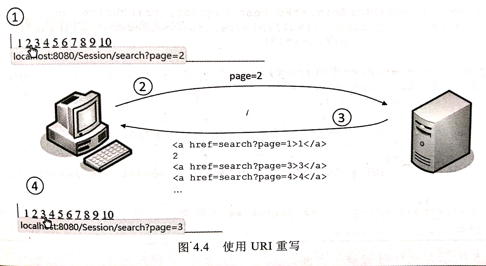

## 会话管理的基本原理
- 有些功能必须由多次请求来完成。
- **会话管理**便是记得之前请求与之后请求间关系的方式。
- 会话管理的**基本方式**有3：
    - **隐藏域(Hidden Field)**
    - **Cookie**
    - **URI重写(URI Rewritting)**
- 会话管理的**原理**：
    - web应用程序不会记得两次请求间的冠
    - 那么便有浏览器在每次请求时主动告知。
    - 做法便是
        >1. web容器将两次请求间的信息在前一次请求的响应中发送个浏览器
        >2. 浏览器在后一次请求是把前一次响应中的信息与本次请求一并发送給浏览器。
        >3. 于是，web容器便能从本次请求获得两次请求间的信息。
- `HttpSession`实现了自动会话管理
    - 使得web容器**看似**记住了浏览器的信息。
    - 它实际上使用了`Cookie`或`URI重写`

### 隐藏域
>隐藏域就是主动告知Web应用程序多次请求间必要信息的方式之一。
>以问卷做答为例：
1. 浏览器将上一页结果发送至Web应用程序。
2. 由Web应用程序将**上一页结果以隐藏域**的方式响应给浏览器。
3. 浏览器将本页结果发送给web应用程序，同时也把**一并发送隐藏域**。
    >于是,Web应用程序便知道了两页问卷的信息。


**注意事项：**
- 隐藏域只适用于**简单的**状态管理，例如问卷。
    >使用隐藏域，显然在关闭网页后就会遗失先前请求的信息。
    >所以仅适合简单的状态管理。
- 隐藏于**不适用于隐秘性**较高的数据。
    >把信用卡数据或密码之类的放到隐藏域更是不可行的方法。

**示例程序：**
```java

后续再写
```

### 使用Cookie
- `Cookie`是**浏览器储存信息**的一种方式。
- web应用程序响应浏览器`set-cookie`标头，浏览器便会将它(标头与数值)**以文件的形式储存**在计算上。
- `Cookie`的处理
    - 可以设定给`Cookie`一个**存活期限**，保留一些**有用的信息**在浏览器。
    - 关闭浏览器后**再打开**，若`Cookie`任在有效期内，浏览器会使用 **`Cookie`标头** 自动将`Cookie`发送给Web应用程序。
        >Web应用程序就可以得知一些先前浏览器请求的相关信息。

>浏览器被预期为每个网站储存20个Cookie,
>总共可以储存300个Cookie
>Cookie的大小不能超过4KB。
>实际数值因浏览器不同而有所不同。


**Cookie API:**
- `Cookie`类，创建时指定`Cookie`中名称与数值。
- `HttpServletResponse`对象`addCookie(Cookie cookie)`方法在响应中新增`Cookie`。
    >HTTP中Cookie的设定是通过标头，所以必须在响应浏览器之前使用`addCookie()`来新增Cookie实例，否则无效
- `Cookie`对象`setMaxAge(int second)`设置`Cookie`的**有效期**，单位为“**秒**”， 默认关闭浏览器之后Cookie失效。
- `HttpServletRequest`对象的`getCookie()`取得该网页**所属域的所有**`Cookie`。返回值是`Cookie[]`数组。
- `Cookie`对象的`getName()`和`getValue()`方法，分别取得名称和数值。

**Cookie实现自动登录：**
`Cookie`的常见应用就是实现**用户自动登录**功能。

**Cookie的安全性：**
- `Cookie`对象的`setSecure(boolean sec)`设定为`true`,那么只会在 **有加密(HTTPS)** 的情况下传送`Cookie`。
- `Servlet3.0`中，`Cookie`类新增方法`setHttpOnly()`方法，将`Cookie`设置为**仅用HTTP**。
    - 会在`set-Cookie`标头附加 **`HttpOnly`属性** 。
    - 这个`Cookie` **不会被`JavaScript`读取** 。
- `IsHttpOnly()`获取Cookie是否被`setHttpOnly()`。
**示例程序：**

```java
后续再写
```


### 使用URI重写
- URI重写，其实就是**GET请求参数**的应用。
- 当Web应用程序响应上一次请求时，将某些相关信息**以超链接方式响应**给浏览器。
- 超链接中**包含请求参数信息**。
- URI重写使用范围：
    - 简单的信息保留。
    - 辅助会话管理。
>URI重写是在超链接**之后附加信息**，
>**必须以`GET*`** 方式发送请求。
>GET本身可以携带的请求参数**长度有限**。
>所以，不适合大量浏览器信息的保留。



## `HttpSession`会话管理
- 可以将会话期间**共享的数据**，保存在`HttpSession`中成为**属性**。


### 使用`HttpSession`
- `HttpServletRequest`对象的`getSession()`方法取得`HttpSession`对象。
    >`getSession()`有两个版本，
    >另一个版本传入布尔值，默认是true，表示尚未存在`HttpSession`实例时,直接创建一个**新的对象**。
    >若传入false，且尚未存在`HttpSession`实例，**直接返回`null`**。
- `HttpSession`对象的`setAttribute(String name, Object obj)`指定名称将对象**设置为属性**。
- `HttpSession`对象的`getAttribute(String name)`指定名称**获取属性**的对象。
- `HttpSession`保存会话信息方法：
    1. 使用`setAttribute()`方法将相关信息设置为属性。
    2. 那么就可以在会话期间使用`getAttribute()`方法会获取相关信息。
- `HttpSession`的有效性：
    - 默认在关闭浏览器前，取得的`HttpSession`都是**相同实例**。
    - `HttpSession`对象的`invalidate()`可以在会话期间**让目前的`HttpSession`失效**。
- **改变`SessionID`**: `Servlet3.1`以后，`HttpServletRequest`新增`changeSession()`改变SessionID。
    >**基于安全考虑**，建议在登录成功后改变SessionID。
    >登录成功之后，为了免于重复验证用户是否登录的麻烦，可以设置一个属性来代表用户做完登录动作。
    >这类识别用户是否登录的属性，通常称为**登录令牌(Login Token)**。

### HttpSession会话管理原理

- 得知数个请求之间的关系的任务实际上是**由Web容器来负责**。
- 使用`HttpSession`来进行会话管理，设定为属性的对象**储存在Web容器**。
    >由于`HttpSession`对象会占用内存空间，所以应该：
    >- `HttpSession`的属性尽量**不要储存**耗资源的**大型对象**。
    >- 必要时**移除属性**。
    >- 或者在不需要`HttpSession`时，执行`invalidate()`让`HttpSession`失效。
- `SessionID`：每个`HttpSession`对象有个ID,称为`SessionID`。
    - `HttpSession`对象的 **`getId()`可以获取`SessionID`** 。
- 浏览器请求应用程序时，会将`Cookie`中的 **`SessionID`一并发送给应用程序**。
    >`SessionID`会默认使用`Cookie`存放在浏览器。
    >`Cookie`的名称是`JSESSIONID`。
    >如果`Cookie`被浏览器禁用，就会使用URI重写来将`SessionID`存放在浏览器。
- Web容器会根据`SessionID`找出对应的`HttpSession`对象。
    >这样就可以取得各浏览器个别的会话数据。


**Cookie失效与HttpSession失效：**
- Web容器储存`Session`的`Cookie`默认为关闭浏览器就失效
- 因此重新启动浏览器请求应用程序时，通过`getSession()`取得是**新的`HttpSession`对象**。
- `Cookie`失效**不是`HttpSession`失效**。
    >只是`Cookie`失效了就无法通过`Cookie`发送`SessionID`,
    >所以容器才会产生新的`HttpSession`对象。
- **`HttpSession`的`setMaxInactiveInterval()`** 设定浏览器多久没有请求应用程序时，**`HttpSSession`自动失效**，设定单位为“**秒**”。
- `web.xml`中也设定`HttpSession`默认失效时间，单位是“**分钟**”
    ```xml
        <session-config>
            <!-- 30 分钟-->
            <session-timeout>30</session-timeout>
        </session-cofig>
    ```
- `Servlet4.0` ，`HttpSession`的**默认失效时间**也可以通过`ServletContext`的`setSessionTimeout()`来设定。

**`Cookie`不可被`HttpSession`代替的功能**
- 储存`SessionID`的`Cookie`默认为关闭浏览器就会失效，
- 而且京用于储存`SessionID`。
- 这意味着一些希望在关闭浏览器后仍然有效的信息，**必须使用`Cookie`操作**。

**配置储存`SessionID`的`Cookie`：**
- `Servlet3.0`新增`SessionCookieCongi`接口。可以设定储存`SessionID`的`Cookie`相关信息
- `servletContext`对象的`getSessionCookieCofig()`方法取得实现该接口的对象
- `SessionCookieConfig`对象的
    - `setName(String name)`将`SessionID`的名称修改为别的名称。
    - `setAge(int second)`设定储存`SessionID`的`Cookie`的存活期限，单位是“秒”。
- 必须在`ServletContext`**初始化之前设定**`SessionCookieConfig`。
    - 可以在`web.xml`中设定
        ```xml
        <session-config>
            <session-timeout>30</session-timeout>
            <cookie-config>
                <name>yourJsessionid</name>
                <secure>true</secure>       <!--只在加密联机中传送-->
                <http-only>true</http-only><!--不可被JavaScript读取-->
                <max-age>1800</max-age>     <!--1800秒， 不建议-->
            </cookie-config>
        </session-config>
        ```
    - 另一个方法是实现`ServletContextListener`。
        >1. 容器在初始化`ServletContext`时会调用`ServletContextLitenser`的`contextInitialized()`方法
        >2. 在其中取得的`SessionCookieConfig`进行设定。
        >- `Servlet4.0` ，`HttpSession`的**默认失效时间**也可以通过`ServletContext`的`setSessionTimeout()`来设定。

### `HttpSession`的建议：
- 建议**不采用默认**的`SessionID`的名称。
- 在**加密**联机中传递`SessionID`。
- 设定**`HTTP-Only`**。
- 用户登录成功之后，**变更`SessionID`**
    >以防止客户端指定了特定的`SessionID`，
    >从而**避免**将重要的登录凭据等信息**存入特定的**`HttpSession`。
- 会话阶段的重要操作前，最好**再进行一次身份确认**。

### HttpSession与URI重写
- `HttpSession`默认使用`Cookie`储存`SessionID`。
- 当用户禁用`Cookie`时，可以**搭配URI重写**来使用`HttpSession`。
    >像浏览器发送一段超链接，超链接URI**后附加`SessionID`**。
- `HttpServletResponse`对象的`encodeURI(String uri)`**协助产生URI重写**。
- `HttpServletResponse`对象的`encodeRedirectURI(String uri)`，可以为指定的复位像URI编上`SessionID`。
    
**URI重写保存`SessionID`的原理：**
当容器尝试取得`HttpSession`实例时。
- 若能取得带`SessionID`的`Cookie`,`encodeURI()`会将传入的URI**原样输出**。
- 若不能(通常是浏览器禁用Cookie的情况)，`encodeURI()`会**自动产生带`SessionID`的URI重写**。


**URI重写的安全隐患：**
在URI上直接出现`SessionID`，有安全隐患。
- 有心人士在指定特定`SessionID`变得容易，而造成 **`Session`固定攻击** 的可能性提供。
- 或者从目前网址链接至另一网址是，因为HTTP的Refere标头而泄露了`SessionID`。